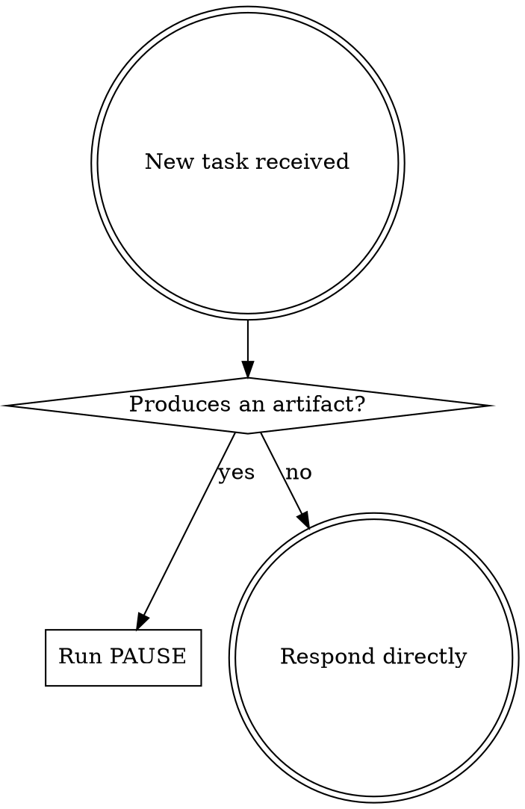
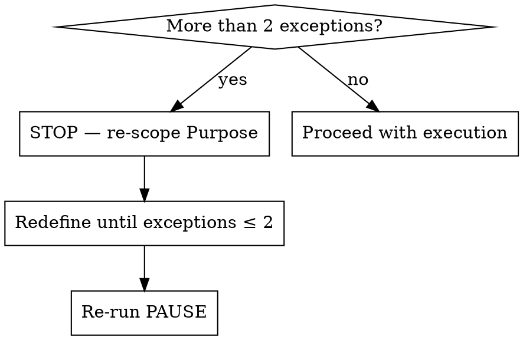

# PAUSE Framework

## Overview

**Think before you build.** PAUSE is a mandatory pre-execution reasoning gate that evaluates every task through five structured dimensions before any output is generated. It ensures clarity of intent, constraints, risk awareness, and correct scoping prior to execution.

**Core principle:** If you can't state the purpose, audience, usage context, constraints, and edge cases in one sentence each, you don't understand the task well enough to execute it.

## When to Use



**Activate before:**
- Generating or modifying code
- Writing documents, reports, or structured content
- Creating prompts, workflows, or system designs
- Producing decisions, plans, or recommendations
- Any task that produces reusable or externally consumed artifacts

**Do NOT activate for:**
- Simple factual queries with no downstream artifact
- Casual conversation without execution intent
- Single-turn clarifications or acknowledgments

## The PAUSE Framework

**This is not optional.** You must write out each field (P, A, U, S, E) with your answer before taking any action. Absorbing the principles without outputting the fields is a violation — the explicit output IS the discipline.

**Violating the letter of this rule is violating the spirit of the rule.**

Run these five steps BEFORE your first implementation action. Output them explicitly — they are the contract for the work.

### P — Purpose

State the intended outcome as a concrete result, not a method or process.

- One sentence: "The purpose is to produce ___."
- Must describe the deliverable, not the activity.
- "Refactor utils.ts" is a process. "A set of focused modules replacing the monolithic utils.ts" is a result.

**Baseline failure this prevents:** Agents start coding immediately without articulating what the output should be — then define success retroactively.

### A — Audience

Identify the actual end user(s) or system consuming the output, with context and expertise level.

- Who reads, runs, or depends on this output?
- What do they know? What do they not know?
- A migration script for a junior DBA needs different safeguards than one for a senior SRE.

**Baseline failure this prevents:** Agents produce technically correct output pitched at the wrong level or missing context the consumer needs.

### U — Usage

State how the output will be used: one-time, repeated, long-lived, or disposable.

- A one-time migration script has different quality requirements than a library function called millions of times.
- Disposable artifacts don't need extensibility. Long-lived ones do.

**Baseline failure this prevents:** Agents over-engineer disposable artifacts or under-engineer long-lived ones.

### S — Settings/Security

State operational constraints, permissions, security, privacy, or safety considerations.

- What are the trust boundaries?
- What data is sensitive?
- What could go wrong if this is misused?
- Include environment constraints (production vs. staging, database size, concurrency).

**Baseline failure this prevents:** Agents ignore security and operational context, producing code that works in dev but is dangerous in production.

### E — Exceptions

State conditions where the default approach would fail or need modification. Limit to the two most critical edge cases.

- If you identify more than two, it signals the Purpose is too broad — re-scope first.
- Exceptions should be specific and actionable, not vague "edge cases."

**Baseline failure this prevents:** Agents treat all inputs and environments as uniform, missing the cases that cause production incidents.

## Output Format

```text
P — Purpose: <one sentence: the concrete deliverable>
A — Audience: <one sentence: who consumes this and their context>
U — Usage: <one sentence: one-time, repeated, long-lived, or disposable>
S — Settings/Security: <one sentence: constraints, risks, trust boundaries>
E — Exceptions: <one or two sentences: critical edge cases>
```

## Execution Gate

Execution is ONLY allowed when:
- All five PAUSE fields are explicitly written out
- No field contains unknowns or unresolved assumptions
- Purpose describes a result, not a process
- Settings/Security includes relevant risk considerations
- Exceptions are ≤ 2 (if more, re-scope Purpose first)

If any condition fails: state what is unresolved, ask only the questions that would materially change the result, and re-run PAUSE before proceeding.

## Exception Handling

If more than two exceptions are identified:



This is not busywork — a broad purpose with many exceptions is a sign you're bundling multiple tasks. Split them.

## Quick Reference

| Field | Question to Answer | Output |
|-------|-------------------|--------|
| **P**urpose | What concrete result will be produced? | One-sentence deliverable |
| **A**udience | Who consumes this and what do they know? | One-sentence consumer profile |
| **U**sage | How long does this live and how often is it used? | One-sentence lifecycle |
| **S**ettings/Security | What constraints, risks, or boundaries apply? | One-sentence risk context |
| **E**xceptions | Where does the default approach break? | ≤ 2 critical edge cases |

## Relationship to Other Skills

**PAUSE answers: *what are we building, for whom, and under what constraints?***

It is a scoping gate — not a completion contract. PAUSE does not define how you'll know the work is done, how you'll prove it, or how you'll prevent scope drift during execution. Those belong to other skills.

- **success-criteria** — Run after PAUSE. SUCCESS defines measurable completion, evidence plans, and scope guards. PAUSE scopes the task; SUCCESS defines done.
Run PAUSE first, then SUCCESS for the completion contract.

## Red Flags — STOP and Rerun PAUSE

- You started writing code without outputting the five PAUSE fields
- You referenced PAUSE conceptually ("the framework requires...") but didn't write the fields
- You skipped PAUSE because the task "seemed straightforward"
- You skipped PAUSE because context was missing (missing context is exactly when PAUSE matters most)
- You treated a missing file or incomplete information as a reason to bypass the framework
- Your Purpose describes a process ("refactor", "add", "fix") instead of a result
- You're three steps into implementation and can't state who the audience is

**All of these mean: pause, output the five fields, then continue.**

## Common Rationalizations

| Excuse | Reality |
|--------|---------|
| "The task is too simple for PAUSE" | Simple tasks still need a purpose statement. 15 seconds to write it. |
| "I need to see the code first" | PAUSE doesn't require code — it requires intent. State what you know. |
| "I'll figure it out as I go" | That's how you produce output that solves the wrong problem. |
| "The user was very specific" | Specific instructions still have implicit audience and constraints. |
| "I can't fill in Settings/Security" | Then you haven't thought about risk. That's the point. |
| "Context is missing, so I'll skip PAUSE" | Missing context is the strongest signal TO run PAUSE — it surfaces what you need to ask. |
| "I referenced the framework in my reasoning" | Referencing is not executing. Write out the five fields. |
| "I internalized the principles" | Internalizing without outputting is skipping the discipline. Write the fields. |

## Common Mistakes

| Anti-pattern | Fix |
|--------------|-----|
| Bundling multiple deliverables in Purpose | One purpose, one artifact. Split if needed. |
| Omitting a field | All five are mandatory — no exceptions. |
| Listing 3+ exceptions without re-scoping | Stop and narrow the Purpose first. |
| Writing Purpose as a process ("refactor X") | Rewrite as a result ("focused modules replacing X"). |
| Treating PAUSE as optional for "simple" tasks | Activate for any artifact-producing task. |
| Skipping PAUSE when file/context is missing | Run PAUSE with what you know — it reveals what to ask. |
