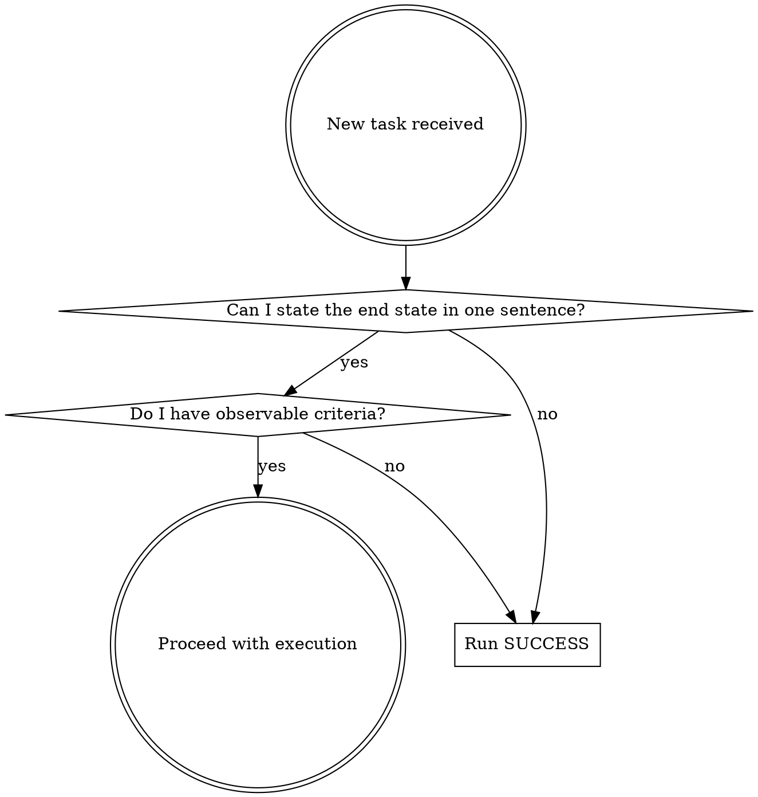

# SUCCESS — Define Measurable Success Before Execution

## Overview

**Define "done" before you start.** Every task needs a concrete end state, observable criteria, and evidence plan BEFORE the first action. SUCCESS is a pre-execution checkpoint that prevents wasted work, scope drift, and unauditable results.

**Core principle:** If you can't state what success looks like, you can't recognize it when you get there.

## When to Use

**Use for:** Any task where you're about to act — features, bugfixes, investigations, refactors, performance work, migrations.

**Skip for:** Pure information questions ("what does this function do?"), single-command operations ("run the tests").

## The SUCCESS Framework

Run these seven steps BEFORE your first implementation action. Output them explicitly — they are the contract for the work.

**This is not optional.** You must write out each step with its header (S, U, C, C, E, S, S) and your answer before taking any action. Absorbing the principles without outputting the steps is a violation — the explicit output IS the discipline. An action plan without the SUCCESS contract above it is incomplete.

**Violating the letter of this rule is violating the spirit of the rule.**

### S — Seek Success

Define "done" as one concrete, valuable end state.

- State a single sentence: "This task is done when ___."
- The end state must be valuable to the user, not just technically complete.
- Ask the user ONLY when ambiguity could materially change the result. Otherwise, state your assumption and proceed.

**Baseline failure this prevents:** Agents jump to implementation and define "done" retroactively, fitting criteria to what they already built.

### U — Uncover Utility

Identify the value, decision, or outcome the user actually needs.

- Optimize for purpose over literal wording.
- Challenge unclear goals: "make it faster" → faster for whom? which operations? what threshold matters?
- A working feature that solves the wrong problem is a failure.

**Baseline failure this prevents:** Agents accept vague requests at face value and start building before understanding what outcome the user needs.

### C — Choose Criteria

Select observable proof standards for success.

- Use concrete signals: quality, speed, coverage, cost, risk, acceptance, absence of avoidable failure.
- State criteria BEFORE acting, not after.
- Criteria must be verifiable by someone other than you.

**Example:** "p95 response time under 200ms on the 5 slowest endpoints" — not "the API feels faster."

**Baseline failure this prevents:** Agents define acceptance criteria as an afterthought in Q&A, not as a prerequisite for execution.

### C — Create Checkpoints

Build validation into the process at known risk points.

- Prefer this hierarchy for handling failure paths:
  1. **Eliminate** — remove the possibility of failure entirely
  2. **Prevent** — stop failure before it happens
  3. **Replace/Simplify** — use a simpler approach with fewer failure modes
  4. **Detect** — catch failure early with tests or checks
  5. **Review/Recover** — last resort, manual inspection or rollback

- Define at least one checkpoint between starting and claiming "done."

**Baseline failure this prevents:** Agents execute a linear sequence of actions with no stop-and-reassess points.

### E — Expose Evidence

Make the result auditable and reusable from the start, not as an afterthought.

- Plan your evidence trail BEFORE executing.
- Use structured logs over print statements. Logs should capture: key decisions, inputs, outputs, errors, and state transitions.
- Record: assumptions made, sources consulted, outputs produced, tests run, verification steps completed.
- Evidence answers: what happened, why, and what changed.

**Baseline failure this prevents:** Agents treat audit trails as a nice-to-have, adding `console.log` or markdown files reactively instead of building observability into the work.

### S — Stay Simple

Remove nonessential work, duplication, and fragile complexity.

- Make the correct path easy and the wrong path hard.
- The smallest useful solution is sufficient.
- If removing something doesn't break the success criteria, remove it.
- Scope additions must justify themselves against the criteria, not against "it would be nice."

**Baseline failure this prevents:** Agents expand scope with good reasoning but no explicit gate — they justify additions post-hoc instead of testing them against predefined criteria.

### S — Sustain Scope

Keep execution anchored to the goal throughout.

- Isolate changes — don't let "while I'm here" work creep in.
- Flag drift explicitly: "This is outside the original scope because ___."
- State tradeoffs when they arise, don't absorb them silently.
- Return to the success criteria at every checkpoint.

**Baseline failure this prevents:** Agents make reasonable scope decisions reactively but don't proactively guard against drift during execution.

## Quick Reference

| Step | Question to Answer | Output |
|------|-------------------|--------|
| **S**eek success | What does "done" look like? | One-sentence end state |
| **U**ncover utility | What outcome does the user need? | Purpose statement |
| **C**hoose criteria | How will we prove success? | Observable, verifiable criteria |
| **C**reate checkpoints | Where do we validate during execution? | Checkpoint list with gates |
| **E**xpose evidence | How do we make the work auditable? | Evidence plan (logs, tests, records) |
| **S**tay simple | What can we remove? | Simplicity constraint |
| **S**ustain scope | How do we prevent drift? | Scope guard with explicit boundaries |

## The Rule

**Before acting, output all seven steps explicitly.** This is the contract for the work. If you can't fill in a step, that's a signal you need more information — ask the user or state an assumption.

Prevent avoidable errors first. Detect and mitigate remaining risks. Ask only follow-ups that would materially change the result. Otherwise, state assumptions and proceed.

## Red Flags — STOP and Rerun SUCCESS

- You wrote an action plan without outputting the seven SUCCESS steps first
- You're three actions in and haven't stated what "done" looks like
- You defined criteria AFTER building the solution
- Your evidence plan is "I'll document it at the end"
- You added scope without checking it against the criteria
- You're optimizing something you haven't measured
- You can't explain how someone else would verify your work
- You're writing `console.log` / `print()` instead of structured logs
- You absorbed the principles but didn't write out the S-U-C-C-E-S-S headers

**All of these mean: pause, run SUCCESS from the top, then continue.**

## Common Rationalizations

| Excuse | Reality |
|--------|---------|
| "The task is too simple for this" | Simple tasks still need a definition of done. 30 seconds to state it. |
| "I'll define criteria as I learn more" | You'll fit criteria to what you already built. Define first, refine at checkpoints. |
| "The user said 'just make it work'" | That's when you MOST need criteria — "works" is not observable. |
| "I know what they mean" | State your assumption explicitly. If you're right, it costs nothing. If you're wrong, it saves everything. |
| "Adding logging slows me down" | Debugging without logs slows you down more. Build it in from the start. |
| "I'll document it at the end" | You won't. And if you do, you'll forget what you tried and why. |
| "Scope is obvious here" | Scope is never obvious. State the boundary. 10 seconds. |
| "I internalized the principles" | Internalizing without outputting is skipping the discipline. Write out the steps. |
| "The action plan covers it" | An action plan is not a SUCCESS contract. Output the seven steps, then the plan. |
| "Investigation tasks don't need this" | Investigations especially need criteria — otherwise you'll explore forever. |

## Structured Logging Note

When the task involves code, prefer structured logging over print statements. Logs should capture key decisions, inputs, outputs, errors, and state transitions needed to debug without rerunning or re-explaining the work.

Use type-safe patterns — type annotations, branded/newtypes, validated schemas at boundaries — even in dynamic languages. Use runtime assertions (`assert`) for internal invariants alongside tests.

**Language references** with full examples (logging setup, type-safe patterns, assertion patterns, tool config):

- `references/python.md` — `structlog`, type hints, Pydantic, `mypy --strict`
- `references/javascript-typescript.md` — `pino`, branded types, `zod`, strict `tsconfig.json`
- `references/rust.md` — `tracing`, newtypes, typestate, `assert!` vs `debug_assert!`

## Common Mistakes

**Defining success after execution.** The whole point is BEFORE. If you find yourself writing criteria that match what you already built, you're doing it backwards.

**Asking too many questions.** SUCCESS says ask ONLY when ambiguity would materially change the result. If you can state a reasonable assumption, do that instead.

**Skipping evidence planning.** "I'll add logging later" means you won't capture the decisions that matter most — the early ones.

**Treating checkpoints as optional.** At least one checkpoint between start and "done." No linear runs.
